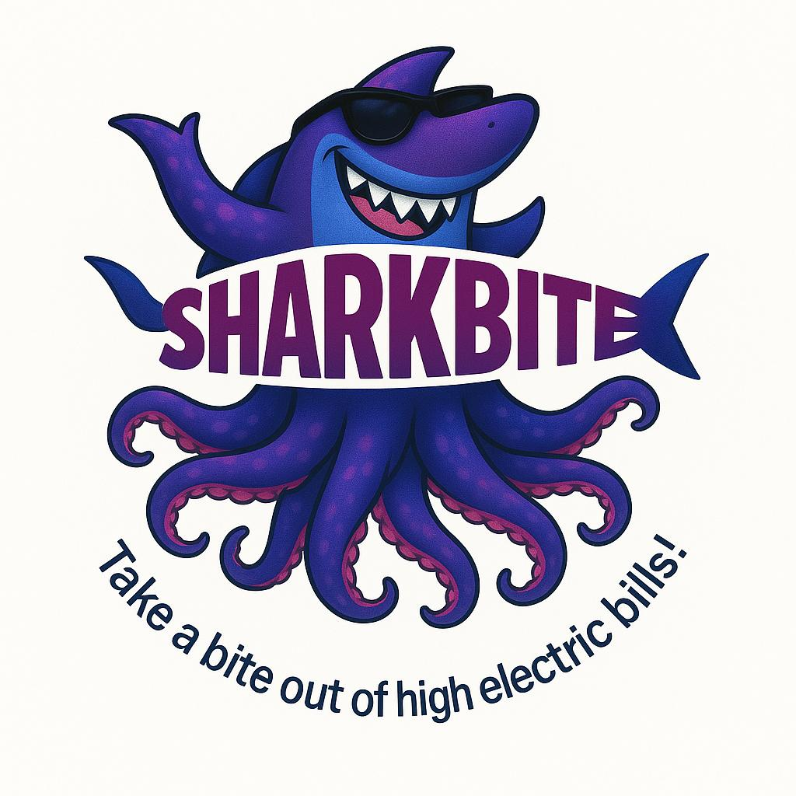
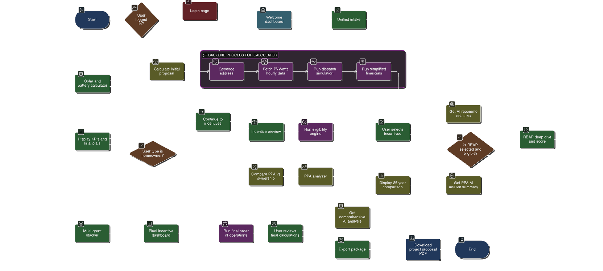

<p align="center">
  
</p>

# 🦈 Sharkbite - Clean Energy Finance Engine

_This project is a **Streamlit-based Minimum Viable Product (MVP) for the Sharkbite platform, designed to help users model the technical and financial viability of clean energy projects** by navigating a complex landscape of incentives and financing options._
<!---
## ✨ Core Features

- **Multi-Screen Workflow:** A guided, 7-step user journey from initial data intake to final report export.

- **Advanced Solar & Battery Calculator:** Performs detailed hourly energy dispatch simulations based on NREL PVWatts data to accurately model savings, self-consumption, & grid independence. Includes "future load" modeling for EVs and heat pumps.

- **Dynamic Multi-Grant Engine:** An eligibility checker that identifies and models over 14 federal & state incentive programs (SWEEP, VAPG, EQIP, CA CORE, etc.) based on user inputs.

- **REAP Grant Scoring:** A live, detailed scoring engine for the USDA REAP grant based on official criteria.

- **Incentive Stacker:** Models the complex interactions and compliance rules (e.g., Federal Share Cap) for stacking multiple grants and tax incentives.

- **AI-Powered Analysis:** Leverages AWS Bedrock (Claude 4.5 Sonnet) to provide contextual recommendations, financial risk analysis, and equipment suggestions.

- **PPA vs. Ownership Analyzer:** An optional, detailed comparison tool for Homeowners to compare the long-term financial outcomes of leasing vs. owning a solar system.

- **Automated PDF Report:** Generates a custom, multi-page, investor-ready PDF summary of the entire project analysis, including embedded charts and AI insights.
--->

## ⚙ Setup and Running the Application
Follow these steps to get the Sharkbite MVP running on your local machine!

**⚡ Prerequisites**
*   Git installed on your system.
*   Miniconda or Anaconda installed on your system.

### 1. Clone the Repository
Open your git bash and run the following command to clone the project files:
```bash
git clone https://github.com/ShruAgarwal/Sharkbite.git
```

### 2. Create and Activate Conda Environment
It is generally recommended to use a Conda environment so as to manage project dependencies and ensure compatibility.

- Open up the Conda terminal and create a new Conda environment named `sharkbite_env` (or your preferred name) with `Python 3.11` (within the main repo):
```bash
conda create -n sharkbite_env python=3.11
```

- Activate the newly created environment:
```bash
conda activate sharkbite_env
```

### 3. Install Dependencies
The necessary Python packages are listed in the `requirements.txt` file. Install them using pip:
```bash
pip install -r requirements.txt
```

### 4. Configure API Keys and Secrets
<!--This application uses the NLR PVWatts API to estimate solar energy production which requires an API key from NLR (previously NREL).-->
> 📌 Replace the placeholder key values with your actual credentials within the `secrets.toml` file below as follows:
```toml
  # .streamlit/secrets.toml
  NLR_API_KEY = "YOUR_API_KEY_HERE"

  # AWS Credentials for accessing Amazon Bedrock model are required to power the AI features.
  AWS_ACCESS_KEY_ID = "YOUR_AWS_ACCESS_KEY_ID_HERE"
  AWS_SECRET_ACCESS_KEY = "YOUR_AWS_SECRET_ACCESS_KEY_HERE"
  AWS_REGION = "us-west-2"  # e.g., Use the region where you have LLM model access -- us-east-1, us-west-1
```
**Do not commit this file with your actual key to a public repository.**

### 5. Run the Streamlit App
Once the environment is set up and the API key is configured, run the following command in your terminal:
```bash
streamlit run sharkbite_app.py
```
This will start the Streamlit development server, and the application should open automatically in your default web browser. If not, the terminal will provide a `local URL: http://localhost:8501` that you can open manually.


## 🚩 App Flowchart
The **flowchart _(Mermaid)_** shows how a user is guided from a simple project idea to a complete, compliant, and investor-ready financial package, with integrated backend processes and optional AI analysis features at each key step.




## 🧰 Tech Stack
[](https://streamlit.io/)
[](https://pandas.pydata.org/)
[](https://numpy.org/doc/)
[](https://matplotlib.org/)
[](https://plotly.com/python/)
[-FF9900?style=for-the-badge&logo=python&logoColor=white)](https://aws.amazon.com/bedrock/)
[](https://github.com/py-pdf/fpdf2)
[](https://pypi.org/project/pytest/)


## 📁 Project Structure
```bash
Sharkbite/
├── .github/
│   └── workflows/
│       └── main.yml                 # GitHub CI/CD Actions
├── .streamlit/
│   └── config.toml                  # Main App Theme
│   └── secrets.toml                 # API keys and other secrets
├── assets/
│   └── custom_style.css             # Custom CSS file
│   └── logo.png                     # App logo
├── static/
│   └── BebasNeue-Regular.ttf        # Custom font family for headers in the app
├── sharkbite_engine/                # Core logic and utilities
│   ├── solar_calculator_logic.py    # Calculation functions for sizing, dispatch, and simplified financials
│   └── incentive_definitions.py     # Structured definitions for all grant and incentive programs
│   └── claude_service.py            # Manages all interactions with the Claude LLM Model on AWS Bedrock
│   ├── pdf_generator.py             # Logic for creating the final PDF report
│   └── ui_login_screen.py           # Streamlit main login screen function
│   └── ui_unified_intake_screen.py  # Streamlit screen 1 rendering functions
│   └── ui_calculator_screen.py      # Streamlit screen 2 rendering functions
│   └── ui_ppa_analyzer_screen.py    # Renders the optional PPA vs. Ownership analysis screen for homeowners
│   └── ui_reap_flow_screens.py      # Streamlit screens 3-7 rendering functions
│   └── utils.py                     # Contains shared constants, helper functions, and the final calculator
├── tests/                           # Automated tests for the application
│   ├── test_e2e_ppa_flow.py                 # E2E test for conditional PPA button rendering
│   ├── test_integration_claude_service.py   # Integration tests for AI service functions
│   ├── test_login.py                        # Test for the login functionality
│   ├── test_unit_calculator_logic.py        # Unit tests for core financial & dispatch logic
│   └── test_unit_utils.py                   # Unit tests for helper functions (REAP, etc.)
├── sharkbite_mvp v1.0/              # Older App Version
├── sharkbite_app.py                 # Streamlit App
├── requirements.txt                 # Project dependencies
├── .gitignore                       # Files/dependencies to ignore
└── README.md                        # About the project & general instructions
```